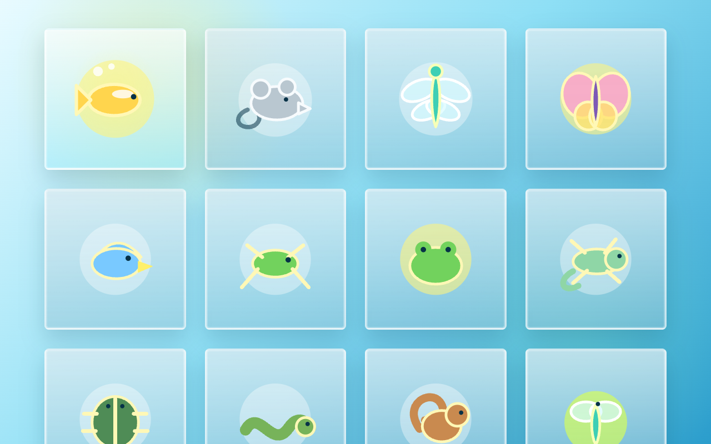
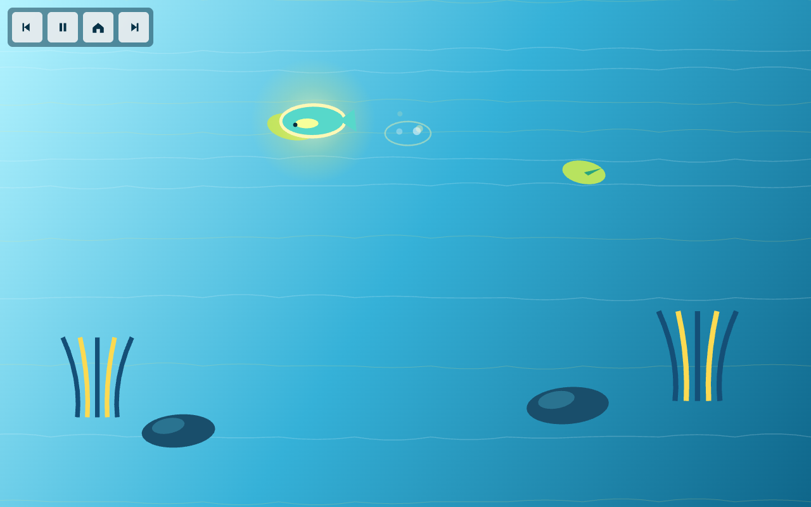
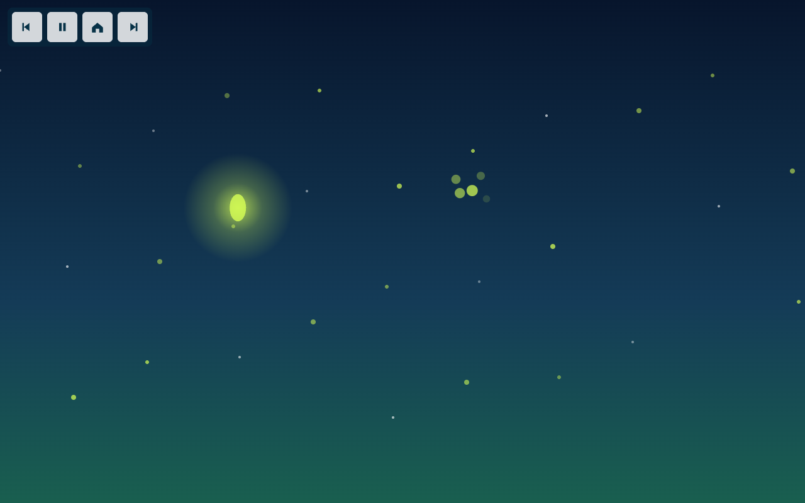

# Cat TV

Cat TV is a touch-screen enrichment game collection for cats. It turns a tablet,
phone, or browser window into a set of simple moving-animal games designed to
attract attention, invite tracking, and give the cat a clear catch moment.

The project is a lightweight React + Canvas web app. It currently includes a
12-game kitten training sequence, starting with slow, obvious targets and
gradually moving toward faster, less predictable motion.



## Project Goal

Cat TV is built around supervised cat play. The interface stays mostly visual:
large animal icons, full-screen animated scenes, and icon-only in-game controls.
The cat sees a target, tracks it, and can tap or paw the screen to catch it.

The design goals are:

- Give cats a simple focus target instead of a busy human game UI.
- Use animal-like movement: swimming, running, hopping, flying, crawling, and glowing.
- Keep every round understandable: cue, target appears, target moves, catch or miss.
- Let the owner switch games quickly without leaving the play session.
- Keep the code easy to extend with more small-animal games.

## Current Games

The lobby contains 12 animal games in a gradual training sequence:

| # | Animal | Scene | Cue | Movement | Training Focus |
|---|---|---|---|---|---|
| 1 | Fish | Pond | Bubbles | Slow curved swim | First focus and catch |
| 2 | Mouse | Grass | Grass wiggle | Ground run | Horizontal tracking |
| 3 | Dragonfly | Air / water | Spark points | Light flight | Air tracking |
| 4 | Butterfly | Flowers | Spark / petal motion | Floating flutter | Smooth vertical tracking |
| 5 | Bird | Branches | Leaf shake | Short dash flight | Faster attention shift |
| 6 | Cricket | Meadow | Grass tremble | Hop movement | Predicting jumps |
| 7 | Frog | Pond edge | Water / plant cue | Larger hops | Timing the catch |
| 8 | Gecko | Wall | Wall ripple | Crawling path | Edge and wall tracking |
| 9 | Beetle | Leaves | Leaf movement | Skitter crawl | Small target tracking |
| 10 | Snake | Sand | Sand ripple | S-shaped motion | Curved path prediction |
| 11 | Squirrel | Branches | Branch shake | Fast branch dash | Rapid direction changes |
| 12 | Firefly | Night grass | Glow points | Blinking drift | Harder visual tracking |





## How The Games Work

Each game uses the same round structure:

1. A small cue appears, such as bubbles, grass movement, leaf shake, or glowing dots.
2. One animal appears as the main target.
3. The animal moves toward the edge of the screen.
4. If the cat touches near the animal, the game shows a rewarding burst of light,
   ripples, petals, or glow.
5. If the animal escapes, the screen briefly darkens and a new round starts.

The full session defaults to 3 minutes. There is no setup screen, no score screen,
and no text-heavy cat-facing interface.

## Navigation

From the lobby:

- Tap an animal icon to start that game.
- Hover or focus an icon to show the animal name.
- The lobby scrolls vertically on smaller screens.

Inside a game, the controls are icon-only and placed on the left:

- Previous game
- Pause / resume
- Home / lobby
- Next game

This makes it easy to move through the full training sequence without returning
to the lobby after every game.

## Safety Notes

This app is meant for supervised play.

- Stay nearby while the cat plays.
- Use Guided Access, screen pinning, or another screen-lock feature when possible.
- Keep volume low and avoid long first sessions.
- Stop if the cat paws too hard, becomes frustrated, or loses interest.
- Clean the screen before and after play.

## Run Locally

Install dependencies:

```bash
pnpm install
```

Start the development server:

```bash
pnpm dev --host 127.0.0.1
```

Open:

```text
http://127.0.0.1:5173/
```

## Verify

Run the test suite:

```bash
pnpm test
```

Build the app:

```bash
pnpm build
```

Run lint:

```bash
pnpm lint
```

## Project Structure

```text
src/
  App.tsx                  App screen flow and game switching
  components/
    GameLobby.tsx          12-animal visual game lobby
    GameCanvas.tsx         Canvas scenes, movement, cue, catch, reward, miss logic
  game/
    games.ts               Game IDs and sequence order
    difficultyConfig.ts    Shared speed, size, and reaction presets
    session.ts             Default 3-minute session and helpers
    SoundManager.ts        Gentle splash/reward sound
    types.ts               Shared TypeScript types
docs/
  screenshots/             README screenshots
```

## Deployment

The project is deployed from GitHub to Vercel. Pushing to the connected GitHub
repository updates the public site through the existing Vercel integration.

Production site:

```text
https://game.cattv.space
```
