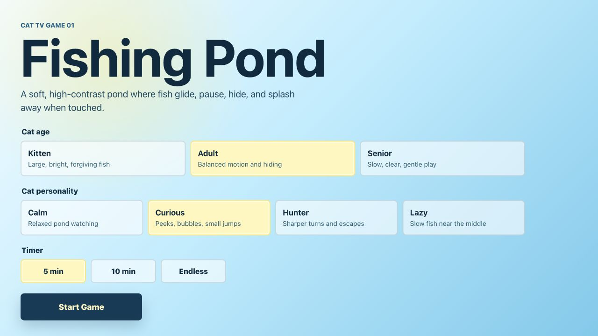
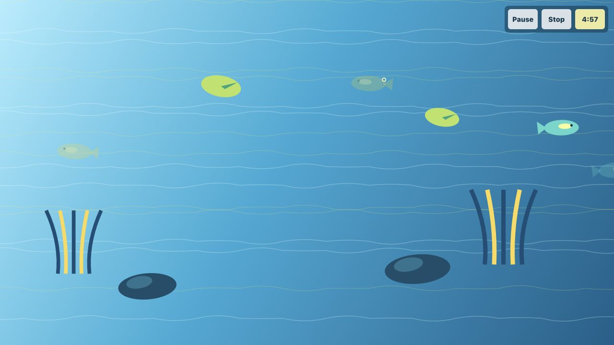

# CatTV: Fishing Pond

CatTV is a small touch-screen cat enrichment project. The first game,
**Fishing Pond**, turns a tablet or phone into a calm digital pond where fish
swim, hide, bubble, and splash away when touched.

The project is built as a lightweight React + Canvas web app so it is easy to
run, test, and extend into future Cat TV games.



## Purpose

Fishing Pond is designed for owners who want a simple, supervised play session
for cats on an iPad, tablet, or mobile phone. The experience favors smooth
motion, clear fish silhouettes, gentle audio feedback, and low-distraction
controls over complicated game mechanics.

It is not meant to be a game cats play alone. Owners should stay nearby, use
screen lock or guided access when possible, and stop the session if the cat
seems frustrated or overstimulated.

## Features

- Fullscreen animated pond with soft water texture.
- 3 to 5 fish visible depending on the selected mode.
- Fish swim horizontally and diagonally, change direction, pause, hide, jump,
  and create bubbles.
- Touching near a fish triggers a quick escape, splash ripple, gentle sound, and
  internal catch tracking.
- Missed touches create a small ripple with no penalty.
- Setup screen for cat age, personality, and timer.
- Minimal in-game owner controls: pause, stop, and optional countdown.
- Session summary with duration, touches, fish reactions, average reaction time,
  and favorite fish type.
- Reusable game foundations for future CatTV games: mode selection, difficulty
  config, touch handling, animation loop, sound manager, and session summary.



## Game Modes

Cat age changes the baseline difficulty:

- **Kitten**: bigger fish, slower speed, brighter and more forgiving.
- **Adult**: balanced fish size, speed, hiding, and direction changes.
- **Senior**: large fish, slower movement, high contrast, and gentler sound.

Cat personality adjusts behavior:

- **Calm**: relaxed movement for watching.
- **Curious**: more bubbles, peeking, and occasional jumps.
- **Hunter**: faster fish, sharper turns, more escape energy.
- **Lazy**: larger slow fish that stay easier to reach.

## How To Use

1. Start the app on a tablet, iPad, or phone.
2. Choose the cat age and personality that best fits the session.
3. Pick a 5 minute, 10 minute, or endless timer.
4. Tap **Start Game** and place the device in landscape orientation if possible.
5. Let the cat watch and touch the fish while you supervise.
6. Tap **Stop** to view the session summary.

For real cat testing, keep the volume low, avoid long sessions at first, and
clean the screen before and after play.

## Run Locally

Install dependencies:

```bash
pnpm install
```

Start the development server:

```bash
pnpm dev --host 127.0.0.1
```

Open:

```text
http://127.0.0.1:5173/
```

If system Node or pnpm is unavailable in this Codex workspace, use the bundled
runtime:

```bash
PATH="/Users/eureka6/.cache/codex-runtimes/codex-primary-runtime/dependencies/node/bin:$PATH" \
  /Users/eureka6/.cache/codex-runtimes/codex-primary-runtime/dependencies/bin/pnpm dev --host 127.0.0.1
```

## Verify

```bash
pnpm build
pnpm lint
```

Bundled runtime version:

```bash
PATH="/Users/eureka6/.cache/codex-runtimes/codex-primary-runtime/dependencies/node/bin:$PATH" \
  /Users/eureka6/.cache/codex-runtimes/codex-primary-runtime/dependencies/bin/pnpm build

PATH="/Users/eureka6/.cache/codex-runtimes/codex-primary-runtime/dependencies/node/bin:$PATH" \
  /Users/eureka6/.cache/codex-runtimes/codex-primary-runtime/dependencies/bin/pnpm lint
```

## Project Structure

```text
src/
  App.tsx                         App screen flow
  components/
    GameCanvas.tsx                Canvas pond, animation loop, touch handling
    ModeSelector.tsx              Owner setup screen
    SessionSummary.tsx            End-of-session summary
  game/
    difficultyConfig.ts           Age/personality difficulty rules
    SoundManager.ts               Gentle splash sound
    types.ts                      Shared game/session types
```

## Safety Notes

- Supervise play. Do not leave the cat alone with the device.
- Use guided access, screen pinning, or a similar screen lock feature.
- Keep sounds gentle and avoid bright flashing effects.
- Stop if the cat paws too hard, becomes frustrated, or loses interest.
